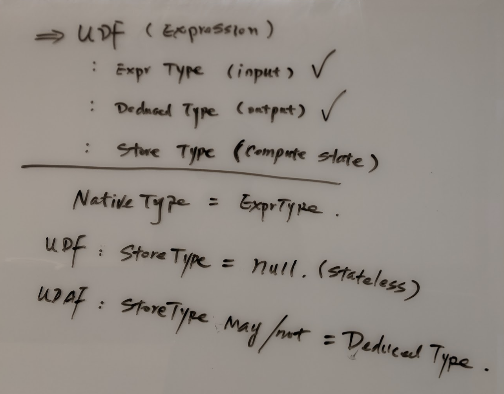

# Expression, UDF, and UDAF
**Nebula** analytics relies on aggregations, and these aggregations are expressed by
* Expressions: including constant ops, arthmetic ops, logical ops and column ops.
  These operations are basics for a programing language, hence they are fundementals to nebula query engine.   
* UDF: nebula will provide native UDFs in its own package implemented with native code.
  We plan to add customized UDF through user interface which will be available in javascript. V8 engine will be used to execute them with interopability with Nebula runtime data strucutre. 
  Basic built-in UDFs are "in", "not in", "like", "ilike", etc.
* UDAF: core analytic capability are supported by "aggregation metrics by dimensions". 
  Nebula provides efficient implementations for them, UDAF like "count", "sum", "avg", "median", "percentiles", "NDV" shall be available.

Plug-in a new UDF / UDAF should be straigtforward in nebula code base, feel free to submit a new request through issue or PR. 

## AVG
UDAF "avg" is an interesting topic, I have been thinking a lot on how to implement it. 
Basically there are two major approaches (well essentially the same concept)
1) Having SUM / COUNT columns in computing time and convert to AVG column at the last step.
In this approach, we flex the schema and operate in query level. 
2) Have "special" column type such as a binary buffer or wider type like int128. 
It is similar to number 1 in terms of flexing schema, but it doesn't change column count.

I think #1 provides pretty generic solution for many similar problem - extend data store in runtime by adding more columns. #2 sounds a bit hacky, but because it maintains same width of schema, a lot of checks and type converts becoming naturely easy. So in the first try, I chose to implement AVG using #2 approach without changing much on the query planning itself.

A very important data structure used in Nebula is called "HashFlat", it's basically a row-based data set with hash function to keep unique rows in contingious memory block. It needs client to provide interfaces to process data in different type:
- Store:    convert UDAF inner expression value into the store type in hash flat.
- Merge:    merge two rows with same keys.
- Finalize: convert store type into desired type.

A UDAF will define these 3 functions, and when a hash flat is setup, a wrapper of this function set will be provided.
So when HashFlat receives a duplicate rows (same keys), it will trigger the merge function, and new row to trigger store method, for most cases, since store type equals native type, it will have empty store and finalize method.

## Percentiles, NDV and others
Follow the same pattern, for any UDAF that requires state management, it can go the same design as AVG using a store type for state management and use finalize method to convert temporary state to final value. 
