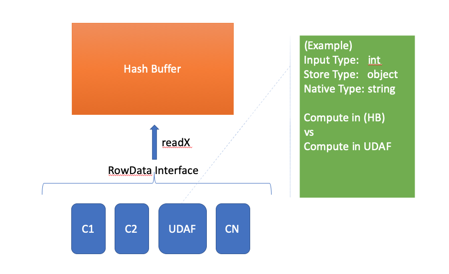

# Sketch: extensible customized aggregation
We need extensible model to support adding any customized data structure for special data aggregation. 
It is challenge to make a decent design fitting into this requirements, let's take a look at what current system

* UDAF/UDF are modeled as generic expressions which represented by ValueEval or TypeValueEval in the runtime.
   * ValueEval is extensible as long as it is visible, it has methods "eval" for value evaluation, "merge" for value merging, "stack" for value accumulation between different types.
   * UDAF needs differentiate input type, runtime type and schema type so that it can finish aggregation life cycle.
* RowData interface is the generic interface used to exchange data between any compute layers.
   * Expressions details are hidden by RowData interface which supports only readXXX methods for each individual supported types in our schema system.
* Sometimes it is not performant if we don't expose "input type" to compute layer when customized type is involved. 

For example, if we're building a TDigest sketch for given expression typed in integer, assuming we have TDigestUDAF which defined types
- input type: INTEGER
- runtime type: TDigest Object modeled as "void*" or better std::shared_ptr&lt;Serializable&gt;
- schema type: VARCHAR

In computing time, when we iterate all rows, remember that the UDAF expression is hidden beind by a RowData interface which only allow a given column which contains the UDAF to expose one type, usually we expose runtime type, that means we only have RowData.readPointer(), the implication here is that we might end up with constructing/descruting huge number of TDigest objects, this doesn't sound correct and definitely not scalable for "customized" sketch.

(External Compute: HB)

To overcome this hurdle, we have a few options to consider
1. Expose UDAF as its inner expression, and leave its aggregation logic to external compute.
   1. e.g SUM(EXPR1) -> EXPR1 through RowData interface
   2. Sure, external compute will have enough metadata to understand how to invoke its logic for aggregation.
   3. Pros & Cons: very straightforward and leave data layer clean. The downside is the inconsistency in the schema, since most of the time, the UDAF result value type differs from its inner expression type.
2. Expose different interface in RowData to allow external compute to fetch inner experssion value instead.
   1. This approach doesn't change its current runtime schema.
   2. Some kind of brokeness on RowData interface.
   3. Difficult to manage life cycle of the custom object since UDAF itself creates object internally and pass to external compute to manage.

None of above approaches is ideal and it is difficult to sort out an ideal approach for now. 
Here is what I propose to do to make this a bit cleaner hopefully:
1. Mainly take approach 1 to keep UDAF interface clean and simple.
2. Push complexity into HB by introducing aggregator object for each defined UDAF.
3. The aggregator may or may not require extra object allocation, depends on if it needs assistant data structure.
   1. CreateObject
   2. Aggregate
   3. Serde
4. We need to allow all UDAF to have different runtime schema but with final schema corrected in last stage.

Hopefully this change will help boost performance as well, for example AVG. Since this is going to be large refactoring, I will leave it to next diff and report back what the result looks like - the basic measure is ensure AVG UDAF is working well/better in the new design.