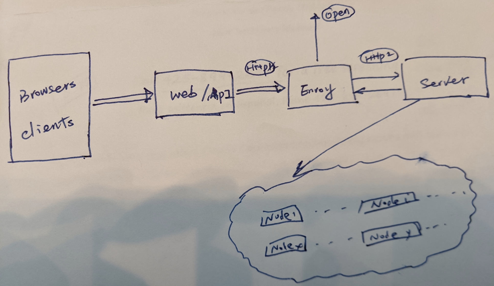

# Web UI
From service deployment perspective, there are 4 major components backs up **Nebula** service.
They are 
1. Nebula Server
2. Nebula Nodes
3. Nebula Service Gateway (Envoy)
4. Nebula Web

Today these components are architectured in this way.

In this mode, we're opening Nebula raw service through envoy as service gateway which usually listens at some port for http traffic, itself maintains connection with Nebula service through HTTP2 (grpc).

Another open service is the web server which listens at standard 80 for browsers request, this service is backed by a NODE server (NodeJS). It serves static content and client logic for Nebula Web UI, this Web UI provides query interface for data analysis and graphics/charting functions for display. 

Why do we architecture it in this way from beginning? Well, there are a few advantages by doing so:
1. It maintains a lightweight web service for least amount of maintaince cost with high QPS for performance.
2. It sets up Web UI as a completely independant component which could be replaced by any tech stack or any new client for consuming the same service.
3. It provides complete UI/service separation for better maintainance. 

I appreciate this arch as it places decoupled design giving us best flexbility to make changes independently.

Now, I'm making a slight change for WEB-UI by routing service consumption behind web server. The reasons why I'm doing so are:
- Authentication. Due to isolation, we need to implement authentication in both interfaces (web + envoy) for single web client. By moving the service behind, we only need to maintain one for web only.
- Security. This change doesn't mean enovy doesn't need authentication. We need to implement it anyways but not priority for now.

After the change, th arch will look like this

The drawback of this change is obvious:
1. for each query, it goes two hops rather than one (Q: client -> web -> (envoy -> server) -> web -> client).
Given the extra hop happens in the same server for most of the cases, the impact should be minimal.
2. adding complexity of query/result transfer logic into web tier which is mostly doing translation.
3. Extra serde (JSON) from server replied object and web client.

After this change, the envoy gateway is still open, but it will not consumed directly by web client.
Also note that, the pros/cons are clear for v1 vs v2, we want to make sure things are easy to switch back and forth. Currently it is supported by a variable `archMode` in web.js, we may move it to nebula config in future.
- archMode = 1 (v1): web client connect nebula server for query.
- archMode = 2 (v2): web client connect web api as proxy for query.

Cheers!
