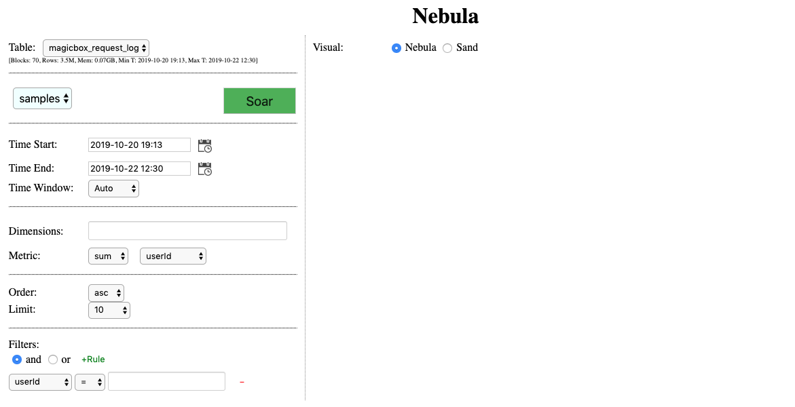
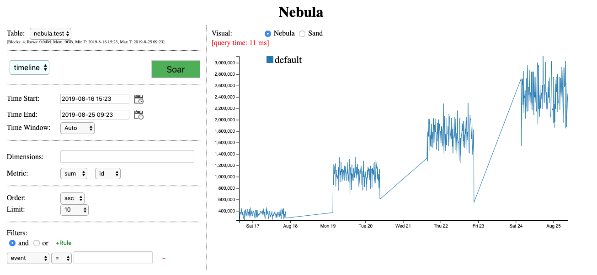
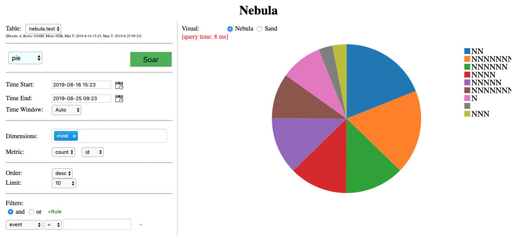

# Get Started With Docker Build
Nebula has published its components to docker hub in a public repository.
This instructions will show you how to get a test data set run with Nebula on your local host as single node cluster.

## Quick Steps
0. Clone "Nebula" repo. And assume you're in ~/nebula/test directory.
1. Edit cluster config by put current host IP address in the single Node
> Replace &lt;ip-address&gt; with your host ip.
2. Run Nebula
> ./local-run.sh
3. Check it out through Nebula UI at: http://&lt;ip&gt;:8088

## Explore Nebula Through Its UI
You should be able to see something like this

From here, you can query the selected table (nebula-test for demo) for different visualizaitons.
1. Timeline Of Nebula Test Entries

2. Table Aggregation By "Event" Column

3. Pie Chart Of Event Distribution By Count

4. Using Awesome Sanddance Library To Explore Data Samples

## Filters / Metrics
Try to apply different filters in your query. 
Try different metrics in query.